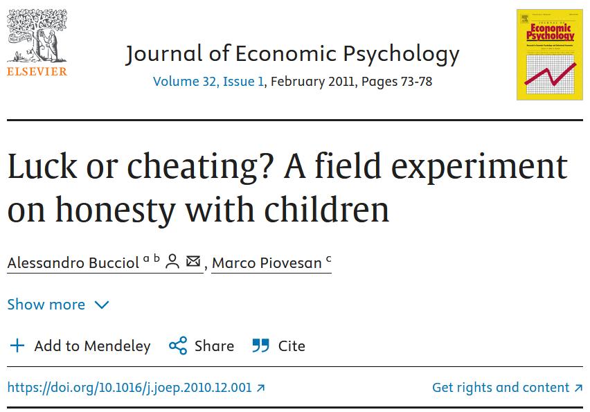
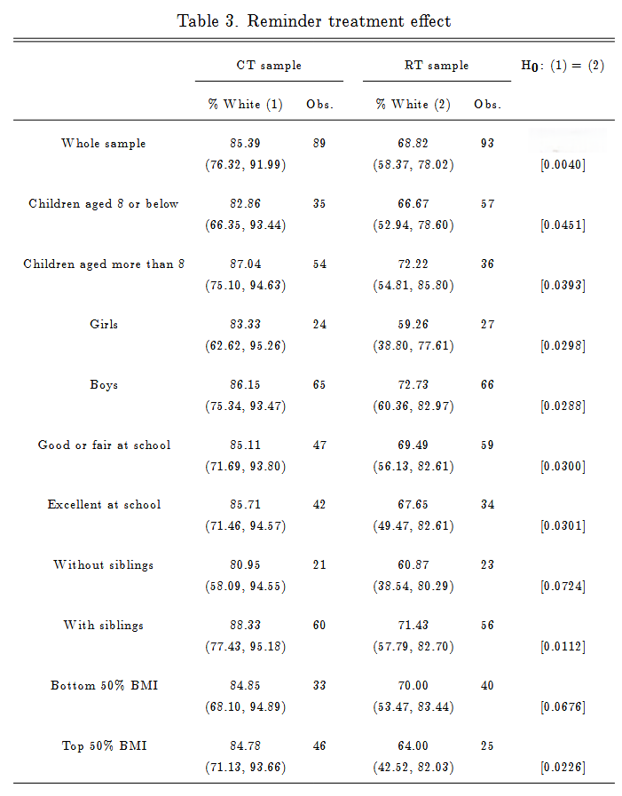

Study the information provided about the paper below.

The full text can be accessed at https://doi.org/10.1016/j.joep.2010.12.001

Researchers studying the relationship between honesty, age and self-control conducted an experiment on 160 children between the ages of 5 and 15. The researchers asked each child to toss a fair coin in private and to record the outcome (white or black) on a paper sheet, and said they would only reward children who report white. Half the students were explicitly told not to cheat and the others were not given any explicit instructions. Differences were observed in the rate of white outcomes in the instruction and no instruction groups, as well as some differences across children’s characteristics within each group. (Bucciol and Piovesan 2011)

See below a table from the study. The right-most column contains p-values for the comparisons between CT (control group, no instructions on cheating) and RT (treatment group, instructed not to cheat). The round brackets in columns 2 and 3, contain confidence intervals for the estimate of percentage white outcomes, right above it. 

Answer the following questions, assuming a statistical significance threshold of 0.05.

1. From the list below, choose all the appropriate variables that were included in the study.
Age  
Sex  
School performance
Control or treatment group
coin flip outcome
p-value
likelihood of cheating
beliefs about cheating
siblings
BMI
socio-economic status
IQ score
reward
religious beliefs
age of parents
country of birth
means of transport

2. Choose all the correct statements from the list below, based on Table 3. 

a) There is a statistically significant difference between the percentage of white outcomes in the CT vs the RT groups.
b) If most children did not cheat, one would expect the confidence interval for the estimate of percentage white outcomes to contain 50%. 
c) There is no statistically significant difference between the percentage of white outcomes in the CT vs the RT groups in children 8 years or below.
d) If most children did not cheat, one would expect the confidence interval for the estimate of percentage white outcomes to contain 5%. 
e) The results statistically support the statement "Girls who are told not to cheat, cheat less than boys who are told not to cheat".
f)The results statistically support the statement "Boys who were told not to cheat, were less likely to report a white outcome".
g)The results statistically support the statement "Both girls who were told not to cheat, and those who were not instructed about cheating, reported more white outcomes, than would be expected by chance".
h) The outcome or explanatory variable is cheating.
i) The outcome or explanatory variable is percentage white outcomes.
j) The outcome or explanatory variable is assigned group (CT or RT).
k) The intervention is cheating. 
l) The intervention is instructions not to cheat. 
m) The intervention is coin flips. 
