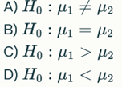

QUIZ FOR DIFFERENCE TESTS, 18.7

### Null and Alternative Hypotheses for Difference Tests

1.  Which of the following correctly states the null hypothesis for testing if two population means differ?

  answer = B

2.  What does the alternative hypothesis represent in a difference test?

A)  The hypothesis that the sample size is large enough  
B)  The hypothesis that data are normally distributed  
C)  The hypothesis that there is no difference between groups  
D)  The hypothesis that a difference exists between groups  X

### Interpreting Parametric and Non-parametric Tests for Continuous Variables

4. Which of the following is a parametric test to compare means from two independent groups? 

A) Wilcoxon rank-sum test  
B)  Chi-square test
C)  Two-sample t-test
D)  Fisher’s exact test

5. For each of the statements below, state whether it is TRUE or FALSE.

A) The t-test is a parametric test, because it provides parameters like a 
p-value in its results.  F
B) The t-test is a non-parametric test, because you do not have to provide
any parameters to perform the test.  F
C) The t-test is a parametric test, because it utilises a theoretical 
distribution, defined by parameters.  T
D) The t-test is a non-parametric test, because it is not based on the normal
distribution, but on the t-distribution.  F

### Statistical Significance vs Practical Significance

11. Statistical significance means:

A)  The observed effect is large enough to be meaningful in practice
B)  The observed effect is unlikely to be due to random chance alone  X
C)  The study’s sample size is large
D)  The effect has clinical or real-world importance

12. Practical significance refers to:

A)  Whether a statistically significant result has meaningful or 
noticeable effects in the real world   X
B)  The p-value threshold used
C)  The probability of a Type 1 error
D)  The size of the dataset

13. A result can be statistically significant but not practically significant, meaning:

A)  The effect size is small despite a low p-value   X
B)  Large effect size and high p-value
C)  Both statistical and practical importance are guaranteed
D)  The sample size is too small

------------------------------------------------------------------------

### Additional Integrated Concepts

14. When interpreting a parametric difference test result with a 
p-value of 0.03, what can be concluded at a significance level of 0.05?

A)  Reject the null hypothesis; there is evidence for a difference   X
B)  Fail to reject the null hypothesis; no evidence for difference
C)  Accept the null hypothesis; there is no evidence for a difference
D)  Accept the alternative hypothesis; there is evidence for a difference

18. When interpreting results from difference tests, a confidence interval 
that includes zero suggests:

A)  A statistically significant difference
B)  No statistically significant difference  X
C)  The alternative hypothesis is true
D)  The p-value is significant

PAPERS ------------------

Read the Methods and Results section of Sam 2018. 

1. For each of the following statements, state whether it is TRUE or FALSE.

a) The researchers used t-tests to compare Day 0 CMV viral loads to CMV viral 
loads for each of Day 4, 7, 14 and 28, at 4 degrees Celsius.  T
b) The researchers used t-tests to compare Day 0 CMV viral loads to CMV viral 
loads for each of Day 4, 7, 14, 28 and 90, at -20 degrees Celsius.  T
c) The researchers tested a total of 11 hypotheses pertaining to the differences 
in CMV viral load at different time points and temperatures. T
d) The researchers considered a p-value of 0.05 statistically significant in 
the difference tests.  F
e) The researchers state that they corrected their p-values for multiple
hypothesis testing.  F

1. What is the most appropriate null hypothesis for comparing CMV viral loads 
at day 0 and day 28 for samples stored at 4 °C?

A. There is a significant increase in viral load between day 0 and day 28.
B. There is no difference in viral load between day 0 and day 28.  X
C. Viral load on day 0 is higher than on day 28.
D. Viral load on day 28 is higher than on day 0.

2. What is the alternative hypothesis for the t-test comparing viral loads 
at day 0 and day 90 for samples stored at −20 °C?

A. Viral load decreases over time during −20 °C storage.
B. Viral load increases over time during −20 °C storage.
C. There is a difference in viral load between day 0 and day 90.  X
D. The viral load remains unchanged.

3. The t-test showed “no difference” in CMV viral load values across 
time points. What does this imply about the p-values?

A. p < 0.05
B. p > 0.05
C. p < 0.01
D. p > 0.01  X

4. If a study reports “no significant difference,” which conclusion is most appropriate?

A. The null hypothesis is rejected.
B. The null hypothesis cannot be rejected.   X
C. The alternative hypothesis is accepted.
D. The t-test was performed incorrectly.

5. In this study, which of the following best describes the findings from 
the t-test results?

A. Viral loads changed significantly over time at both temperatures.
B. Viral loads significantly increased during storage for 20 °C.
C. Viral loads remained stable over time at both 4 °C and −20 °C.   X
D. Viral loads significantly increased during storage.

8. Which statement correctly interprets the mean viral load results for 
samples stored at -20 °C?

A. Viral load decreased by 0.13, from day 0 to day 4, but the change
was not statistically significant.   X
B. Viral load decreased significantly from baseline by 0.03 by day 28.
C. There is evidence that the viral load change over 28 days was not due 
to random chance.
D. There is no significant difference in viral load between 4 °C and -20 °C.

10. For each hypothesis below, state TRUE if it was included in the hypotheses 
that the researchers tested, and FALSE if they did not test this hypothesis.  

A. There is no difference in viral load over 4 days between samples stored 
at 4 °C and -20 °C.  F
B. There is no difference in viral load over 90 days for samples stored at 4 °C.  F
C. There is no difference in viral load over 28 days for samples stored at -20 °C.  T
D. Storage time is not associated with viral load for samples stored at 4 °C.  T

